# Hello World

# 1. 今回のゴール
CHIRIMEN BLE の使い方をおぼえて、Webアプリから「Lチカ」（LEDをつけたりけしたり）するプログラミングをやってみよう。

1. 今回のゴール
2. 事前準備
3. Lチカをやってみよう
4. コードを眺めてみよう

## CHIRIMEN BLE とは
まず CHIRIMEN BLE の基礎となっている CHIRIMEN とは [Web GPIO](http://browserobo.github.io/WebGPIO/) や、[Web I2C](http://browserobo.github.io/WebI2C/) といった JavaScript の API を使用してセンサーやアクチュエーターなどの物理デバイスを Web 技術だけで制御する事ができる IoT 環境です。

実際に利用できる環境として、現在 Raspberry Pi 3 上で動作する「CHIRIMEN for Raspberry Pi 3 が CHIRIMEN コミュニティにより公開されています。

CHIRIMEN for Raspberry Pi 3 についての詳しい情報は以下のリンクを参照してください。  
[CHIRIMEN 公式ページ](https://chirimen.org/)  
[CHIRIMEN チュートリアル](https://tutorial.chirimen.org)  

CHIRIMEN for Raspberry Pi 3 の構成  


CHIRIMEN BLE はこれを発展させて、Bluetooth LE (BLE) でワイヤレス接続されたセンサーやアクチュエーターの BLE インターフェースボードと PC 等のブラウザの組み合わせで動作可能にした IoT 環境になります。BLE のインターフェースボードとしてはスイッチサイエンス社の BLE 開発ボード TY51822r3 を使用します。

CHIRIMEN for Raspberry Pi 3 では ラズベリーパイに接続されたセンサー等をラズベリーパイ自身の上で動作する Web アプリで制御するのに対し、CHIRIMEN BLE では、BLE ボードに接続されたセンサー等をワイヤレス接続する PC 等の上で動作する Web アプリで制御します。

CHIRIMEN BLE の構成  
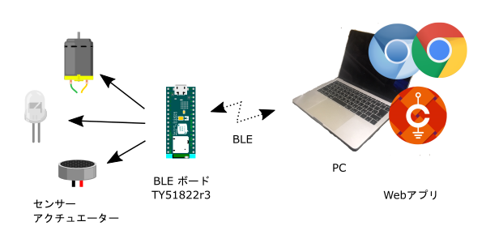

上の図では、Web アプリを動かす側が PC となっていますが Chrome または Chromium ブラウザであれば動作しますので、Raspberry Pi と BLE ボードの組み合わせでセンサーと本体が分離した組み込み型の機器などを作る事も可能です。

# 2. 事前準備 (機材確認)

## 用意するもの

### 基本ハードウエア
下記が CHIRIMEN BLE の起動に最低限必要となる基本ハードウエアです。

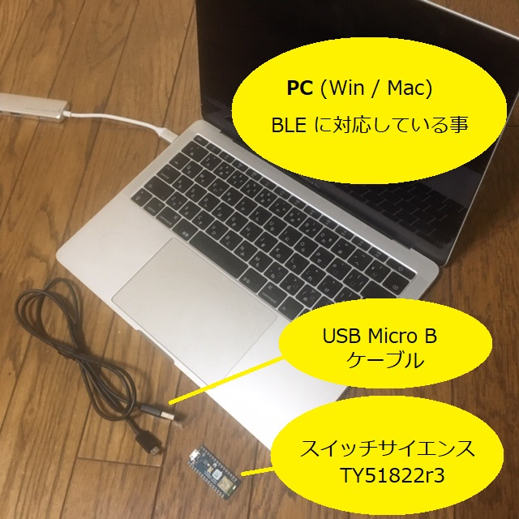

* BLE 開発ボード [スイッチサイエンス TY51822r3](https://www.switch-science.com/catalog/2574/?gclid=CjwKCAiA9efgBRAYEiwAUT-jtO3rkZ_sHHdPO15clRze6Sp-oG1NNPB7Kj2A36Hv1ddqWbHO6YHXYxoCOcQQAvD_BwE) × 1
* PC (Windows または Mac、BLE に対応している事) × 1
* BLE 開発ボードに電源を供給するための USB Micro B ケーブル x 1

BLE 開発ボード側のコネクタは USB Micro B ですので、PC 側のコネクタが USB-C 等の場合は適宜アダプタ等を使用してください。また、BLE 開発ボードと PC のデータ的な接続は BLE で行いますので、BLE 開発ボードへの給電は PC からではなく、別途用意された AC アダプタ等からでも構いません。

### L チカに必要となるパーツ
CHIRIMEN BLE を動作させる最も簡単なテストである「Lチカ (えるちか)」を行うには下記パーツも必要になります。

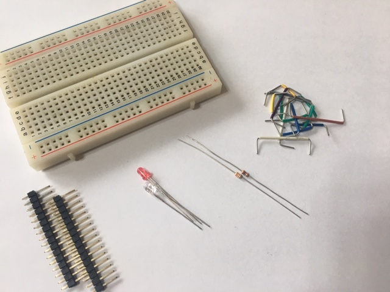

* ピンヘッダー 2.54mm 16ピン x 2
* ブレッドボード × 1
* LED 赤 × 1、青 x 1
* 抵抗器 330Ω × 2
* ブレッドボードの配線に使用するジャンパー線　x 適宜

LED の 1 つは BLE の接続状態の表示のために使用しますので、1 つだけでも L チカの動作は可能です。

## TY51822r3 にピンヘッダーを半田付けする

TY51822r3 はピンヘッダーが無い状態で販売されています。これ以降の L チカ等のテストを行うためにブレッドボードで使用するにはまず、端子 (16 ピン 2 列) にピンヘッダーを半田付けしておく必要があります。

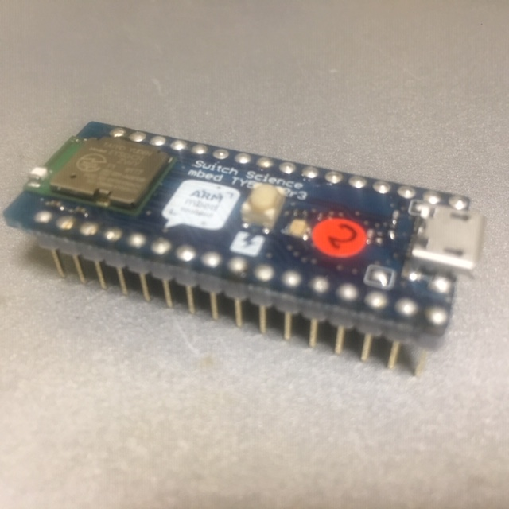

## TY51822r3 に CHIRIMEN BLE の IO プログラムを書き込む

TY51822r3 には mbed で CHIRIMEN BLE 用の IO プログラム (btGPIO_TY51.TY51822R3.hex) を書き込んでおく必要があります。
ビルド済みのバイナリファイルを準備していますので下のリンクからダウンロードしてください。

TY51822r3 を USB で PC と接続するとドライブとして認識するはずですので、ダウンロードした hex ファイルをそのドライブにコピーすると TY51822r3 の基板上の LED がしばらく点滅し、書き込みが行われます。

[btGPIO_TY51.TY51822R3.hex](./btGPIO_TY51.TY51822R3.hex)  

TY51822r3 用の IO プログラムを自分でビルドしてみたい場合は mbed のオンラインコンパイラを使用します。この手順については [TY51822r3 の CHIRIMEN BLE IO プログラムをビルドする](bridge) を参照してください。

## PC に CHIRIMEN BLE の本体をダウンロードする

CHIRIMEN BLE の本体は GitHub で公開されています。  

[Nakamura2013/chirimenble](https://github.com/Nakamura2013/chirimenble)  

上のリンクにアクセスし、右側の緑のボタンを押して　"Download ZIP" のリンクからダウンロードできます。ダウンロードしたファイルは ZIP で固められていますので展開して適当な場所に配置してください。gc というフォルダの下に GPIO や I2C を使用した各種サンプルの HTML ファイルがあります。
動作させるにはブラウザから直接ファイルを file:// で開いて構いません。

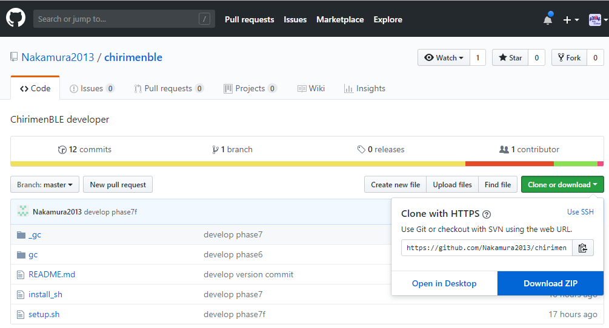

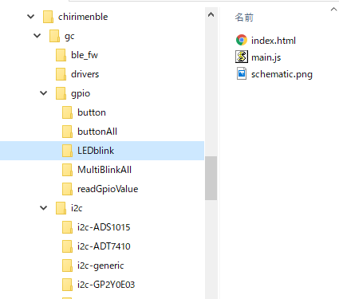

# 3. 「L チカ」をやってみよう
無事、TY51822r3 と PC の準備が整ったら、いよいよ L チカに挑戦してみましょう。

## 「L チカ」とは？
「L チカ」とは、LED を点けたり消したりすることで、チカチカさせることです。今回は「LEDを点ける」「LEDを消す」をプログラムで繰り返し実行することで実現します。これによって PC 上で動作している JavaScript のプログラムから BLE 経由で TY81522r3 に接続された周辺機器を動かせる事を確認できます。

* 参考：[LED（発光ダイオード）](https://ja.wikipedia.org/wiki/%E7%99%BA%E5%85%89%E3%83%80%E3%82%A4%E3%82%AA%E3%83%BC%E3%83%89)

この L チカのサンプルは PC にダウンロードした chirimenble の `gc/gpio/LEDblink` のフォルダーに入っています。

## 配線してみよう
L チカのサンプルのフォルダ内の `schematic.png` に配線図がありますので、ブレッドボード上でこの通りに配線します。

```
gc/gpio/LEDblink/schematic.png
```

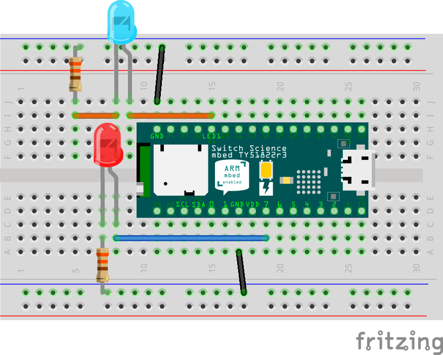

LED は2本のリード線が出ていますが向きがあり、長い方がアノード（+側）、短い側がカソード（-側）です。LED のリード線の方向に注意しながら、この図の通りにジャンパー線やブレッドボードを使って配線してみましょう。配線図では LED の下側のリード線が折れ曲がり長い方がアノード (+側)です。部品のリード線を既に切ってしまって元の長さがわからなくなっている場合は、少し見づらいですが、一般的な LED なら内部の電極の形状で小さい方がアノード (+側) と判断する事もできます。

LED が 2 個使われていますが、赤い LED の方が今回のサンプルで点滅させるターゲットの LED になります。
青い LED は TY51822r3 の BLE の接続状態を表示するためのものです。以降のサンプルでも青い LED の部分は同様に出てきますが、無くてもサンプルの動作自体は可能です。

実際に配線してみると、こんな感じになりました。

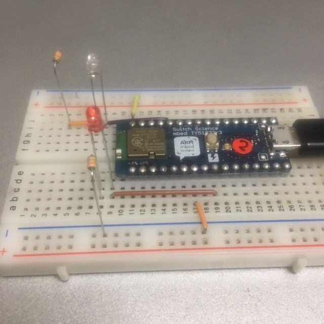

### 参考
* [ブレッドボードの使い方](https://www.sunhayato.co.jp/blog/2015/03/04/7)
* [LEDの使い方](https://www.marutsu.co.jp/pc/static/large_order/led)
* [抵抗値の読み方](http://www.jarl.org/Japanese/7_Technical/lib1/teikou.htm)
* [テスターを使って抵抗値を確かめる](http://startelc.com/elcLink/tester/elc_nArtcTester2.html#chapter-2)

## example を実行してみる
配線がうまくできたら、さっそく動かしてみましょう。
L チカのためのサンプルコードは先ほどの配線図と同じフォルダに格納されています。

```
gc/gpio/LEDblink/index.html
```

ブラウザは Chrome / Chromium を使用してください。
`index.html` をブラウザにドロップするか、デフォルトブラウザが Chrome / Chromium であれば `index.html` をダブルクリックするとサンプルが起動します。ブラウザには次のような画面が表示されるはずです。

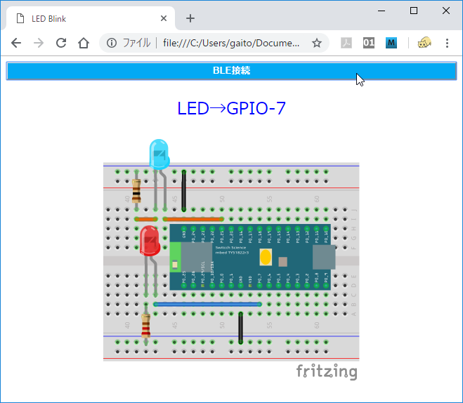

さてサンプルが起動しましたが、この状態ではまだ BLE の接続がされていません。次にブラウザ画面の上部にある「BLE 接続」の青いバー型のボタンをクリックします。

すると Bluetooth のスキャンが行われ、次のようなダイアログが表示されます。

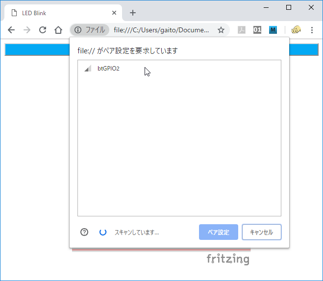

TY51822r3 がちゃんと動作していれば、リストに btGPIO2 が見つかるはずですので、それを選択して「ペア設定」のボタンを押すとダイアログと青いバーが消え、赤い LED が点滅して L チカが動作しはじめるはずです。

なおこの時、青い LED も点灯しますが、こちらは BLE の接続が確立されている事を表しています。

* 消灯 : 未接続
* 点灯 : 接続中
* 点滅 : 通信中 (BLE モジュール動作中)  

となりますので、赤の LED の状態が切り替わるタイミングで一瞬消灯するのがわかるかと思います。

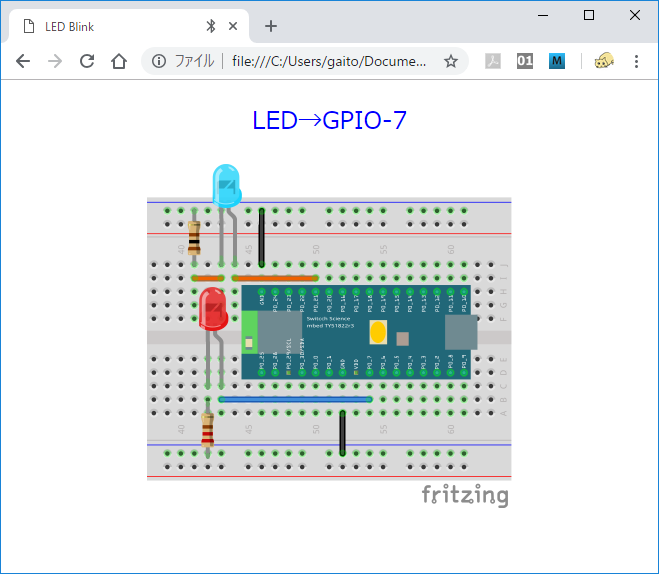

## Lチカの様子

[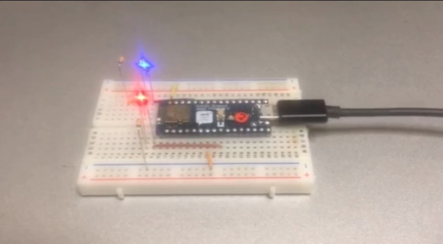](imgs/section0/blink.mp4)

L チカに成功しましたか？！

## うまくいかなかったら?
* 複数のブラウザやタブ等から同じデバイスに接続しようとした場合などは正常に動作しません。
  * まず他のブラウザやタブを閉じてから試してください。
  * TY51822r3 の基板にある黄色いリセットボタンを押してから再度試してみてください。

* BLE の接続で対応デバイスが見つからない場合
  * TY51822r3 が正常に動作していない可能性があります。USB コネクタからの電源の供給、mbed でのプログラムの書き込みが正常に行われたか等を確認してください。

* BLE の接続はされるが LED が点滅しない場合
  * ブレッドボード上の配線を確認してください。

# 4. コードを眺めてみよう

## HTML

```html
<!doctype html>
<html>
  <head>
    <meta charset="UTF-8" />
    <title>LED Blink</title>
    <script src="../../polyfill/blePolyfill.js"></script>
    <script src="./main.js"></script>
  </head>
  <body>
  <div><input type="button" id="BLECONN" value="BLE接続"></div>
  </body>
</html>
```

見やすくするためにスタイル関係等を除いて重要な部分だけを抜き出していますが、HTML では最初に ```blePolyfill.js``` という JavaScript ライブラリを読み込んでいます。  

CHIRIMEN for Raspberry Pi 3 を触った事がある方ならわかると思いますが、CHIRIMEN for Raspberry Pi 3 では ```polyfill.js``` という名前のライブラリによって [Web GPIO API](http://browserobo.github.io/WebGPIO/) と、[Web I2C API](http://browserobo.github.io/WebI2C/) がサポートされていましたが CHIRIMEN BLE ではこれが ```blePolyfill.js``` に変わっています。

この [Polyfill (ブラウザ標準に未実装の機能などを利用可能にするためのライブラリ)](https://developer.mozilla.org/ja/docs/Glossary/Polyfill) を最初に読む込むことで GPIO や I2C の API が使えるようになります。

また、HTML には BLE を接続するためのボタンが準備されています。CHIRIMEN BLE では WebBluetooth による BLE 接続を使用しますが、セキュリティ上の制限によりユーザーがボタンを押すなどのアクションをトリガーとして接続を開始しなくてはなりません。つまり、アプリを起動するだけで勝手にデバイスに接続して動き始めるような使い方はできません。

## JavaScript
```javascript
'use strict';

const DEVICE_UUID     = "928a3d40-e8bf-4b2b-b443-66d2569aed50";
let connectButton;
window.addEventListener(
  "load",
  function() {
    connectButton = document.querySelector("#BLECONN");
    connectButton.addEventListener("click", mainFunction);
  },
  false
);

async function mainFunction(){ // プログラムの本体となる関数、非同期処理のためプログラム全体をasync関数で包みます。
	var bleDevice = await navigator.bluetooth.requestDevice({
      filters: [{ services: [DEVICE_UUID] }] });
	var gpioAccess = await navigator.requestGPIOAccess(bleDevice); // thenの前の関数をawait接頭辞をつけて呼び出します。
	connectButton.hidden = true;
	var port = gpioAccess.ports.get(7);
	await port.export("out");
	var v = 0;
	while ( true ){ // 無限ループ
		await sleep(1000); // 1000ms待機する
		v ^= 1; // v = v ^ 1 (XOR 演算)の意。　vが1の場合はvが0に、0の場合は1に変化する。1でLED点灯、0で消灯するので、1秒間隔でLEDがON OFFする。
		port.write(v);
	}
}

// この関数の定義方法はとりあえず気にしなくて良いです。コピペしてください。
// 単に指定したms秒スリープするだけの非同期処理関数
function sleep(ms){
	return new Promise( function(resolve) {
		setTimeout(resolve, ms);
	});
}
```

### 注記
CHIRIMEN BLE はウェブブラウザをプログラムの実行環境として用いてシステムを構築します。ウェブブラウザが実行できるプログラムのプログラミング言語は JavaScript です。JavaScript を学んだことのない人は、まず[こちらの資料「JavaScript 1 Day 講習」](https://r.chirimen.org/1dayjs)を履修しましょう。

## 非同期処理について

物理デバイスやネットワーク通信などを行う際には、応答待ちの間にプログラムが全て停止してしまわないよう非同期処理を行う必要があります。
本チュートリアルではこれを [async 関数](https://developer.mozilla.org/docs/Web/JavaScript/Reference/Statements/async_function) を用いて記述しています。非同期処理を知らない人や async 関数による記述をしたことのない人は、必要に応じて[こちらの資料「非同期処理 (async await版)」](appendix0.md) も参照してください。

実は非同期処理をすべて理解して使いこなすのはとても難しいのですが、本チュートリアルでは次のルールが分かっていれば大丈夫です:

* GPIO や I2C の初期化、ポートの設定などは非同期関数として定義されているため `await` キーワードを付けて呼び出す
  * `await` を付けることで、初期化などが完了してから次の処理が行われるようになります
  * `await` なしで呼び出すと初期化などの完了前に次の行の処理を続け、初期化前のポートを操作しようとして失敗したりします
* `await` で非同期関数を呼び出す処理を含む関数は `async function 関数名() { ... }` のように `async` を付けて非同期関数として定義する
* `async` 付きで定義した関数の呼び出し時には必ず前に `await` を付けて呼び出す
  * GPIO や I2C を使う処理は基本的に入れ子で `await` 呼び出しを連鎖させます

非同期関数を `await` なしで呼び出すと返り値は Promise オブジェクトとなるため Promise についての理解が必要になりますが、常に `await` 付きで呼び出すようにしていれば従来通りの同期間数の呼び出しと同じ感覚でコードが書けます。

### Note:
本チュートリアルで非同期処理を async 関数に統一している理由は (Promise を扱ったり古典的なコールバック処理を書くより) 初心者にとってわかりやすいシンプルで読みやすいコードになるからです。この機能は比較的新しい JavaScript 言語機能 (ECMASCript 2017) ですが、主要なブラウザでは既にサポートされています。  
([様々なウェブブラウザでのサポート状況](https://caniuse.com/#feat=async-functions))

## 処理の解説

CHIRIMEN BLE では動作を開始する前にまずユーザーアクションをトリガーとして BLE の接続を行う必要があります。プログラムの本体となる ```mainFunction``` は「BLE 接続」のボタンのハンドラとして設定されており、ボタンが押された時に走り始めますが、ここで最初に行うのは ```navigator.bluetooth.requestDevice()``` による BLE デバイスの取得です。

この時にスキャンが行われて BLE のダイアログが表示され、ユーザーが相手のデバイスを「ペア設定」のボタンを押すまで一時停止する事になります。リクエストの際に ```filters: [{ services: [DEVICE_UUID] }]``` という指定が行われており、`DEVICE_UUID` は `"928a3d40-e8bf-4b2b-b443-66d2569aed50"` という長い ID となっていますが、これが CHIRIMEN BLE のデバイス側のサービスを表す ID で、この CHIRIMEN BLE を利用するすべてのプログラムで共通して使用される ID になります。

BLE デバイス ```bleDevice``` を取得した次に行うのは ```navigator.requestGPIOAccess(bleDevice)``` によって GPIO にアクセスするためのインタフェース ```gpioAccess``` の取得です。今までの [Web GPIO API](http://browserobo.github.io/WebGPIO/) でしたら ```gpioAccess``` の取得は ```navigator.requestGPIOAccess()``` のように引数なしで呼び出すのですが、ここにターゲットの BLE デバイスを渡すようになっています。

さて、ここまでが CHIRIMEN BLE と CHIRIMEN Rapberry Pi 3 のソフトウェアとしての大きな違いになる部分です。```gpioAccess``` を取得した後は今までの [Web GPIO API](http://browserobo.github.io/WebGPIO/) と違いはありません。

## TY51822r3 のピン配置

ここで CHIRIMEN BLE で使用される TY51822r3 のピン配置について説明しておきます。

TY51822r3 には全部で 32 本のピンがありますが、CHIRIMEN BLE の環境では下の図で明るい緑で書かれた名前のようにピンが使われます。

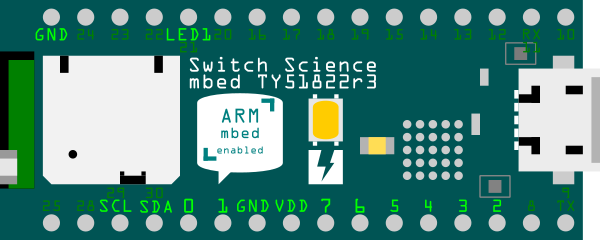

CHIRIMEN BLE では、BLE ボード の TY51822r3 が持っているピンの内、P0_0 から P0_7 の 8 本のピン、上の図で 0 から 7 の数字が振られたピンを [Web GPIO API](http://browserobo.github.io/WebGPIO/) が扱う [GPIO (General-purpose input/output)](https://ja.wikipedia.org/wiki/GPIO) ピンとして汎用的な入出力インタフェースに利用する事ができます。

CHIRIMEN BLE の GPIO 端子は、GND 端子との間に、0V もしくは 3.3V の電圧を印加(出力)したり、逆に 0V もしくは 3.3V の電圧を検知(入力)したりすることができます。LED は数 mA の電流を流すことによって点灯できる電子部品です。LED は一定以上の電圧 (赤色 LED だと概ね 1.8V 程度、青色 LED だと 3.1V 程度) 以上になると点灯する性質を持っており、印加する電圧を 3.3V (点灯)、0V (消灯) と変化させることで L チカを実現します。

また、上の図で LED1 と書かれているピンがこのサンプルで青い LED を接続したピンで、CHIRIMEN BLE では BLE の接続状態を表す専用の出力ピンとして使用されます。

なお、このサンプルでは使用しませんが、SCL、SDA のピンは [Web I2C API](https://rawgit.com/browserobo/WebI2C/master/index.html) で使用するピンです。このピンの配置は CHIRIMEN BLE 環境でのもので、mbed 公式の TY51822r3 のピン配置とは異なる事に注意してください。

## GPIO のドライブ能力

GPIO 端子に LED 等の部品を接続する際には端子のドライブ能力にも注意する必要があります。TY51822r3 の公式の仕様では GPIO 端子が (標準の設定で) ドライブできる電流は 0.5 mA までと書かれていますが、LED を直接繋ぐにはやや心もとない数字です。CHIRIMEN BLE の環境では GPIO 端子の high drive 設定という機能を利用して、GPIO の端子あたり 5 mA までの電流をドライブできる設定になっています。

ただしもう一つ、デバイス全体での電流が 15 mA までという制限があり、この範囲内で使用する必要があります。つまり、LED に 5 mA の電流を流すのであれば LED は同時に 3 個光らせるのが限界という事に注意してください。

## GPIOPortの処理

さて ```gpioAccess``` を取得した後のコードですが ```var port = gpioAccess.ports.get(7);``` という部分で、**GPIOの7番ポートにアクセスするためのオブジェクト** を取得しています。

続いて、```await port.export("out")``` で、**GPIOの7番を「出力設定」** にしています。これにより LED への電圧の切り替えが可能になっています。

ここで、関数の呼び出しに ```await``` 接頭詞がついていることに注意してください。この関数は非同期処理の関数でその処理の完了を待って次の処理に進みます。そして await 接頭詞を使いますので、それを使っている関数 ```mainFunction()``` は async 接頭詞が付く、非同期処理の関数となっています。

最後に ```await sleep(1000)``` で 1000ms = 1 秒 待機させて無限ループをつくることで、 1 秒毎に ```port.write(1)``` と ```port.write(0)``` を交互に呼び出し、GPIO 7 番に対する電圧を 3.3V → 0V → 3.3V → 0Vと繰り返し設定しています。


まとめると下図のような流れになります。


## example を修正してみよう
JavaScript のコードに変更を加えると、L チカの動作を変える事ができます。
試しにいろいろ変えてみましょう。

* 点滅を早くしたり遅くしたりしてみる
* GPIO ポートを他のポートに変えてみる (指定した GPIO へブレッドボードの配線を変える必要があります)
* index.html にボタンなどのインターフェースを作ってみて、押すと LED が反応するよう変えてみる

# まとめ
このチュートリアルでは、下記を実践してみました。

* CHIRIMEN BLE の起動
* L チカのサンプルを動かしてみた
* L チカのコードを変更してみた

このチュートリアルで書いたコードは以下のページで参照できます:

* [GitHub リポジトリで参照](https://github.com/chirimen-oh/tutorials/tree/master/raspi3/examples/section0)
* ブラウザで開くページ
  * [L チカコード (画面は空白)](https://tutorial.chirimen.org/raspi3/examples/section0/s0.html)

次の『[チュートリアル 1. GPIO編](https://tutorial.chirimen.org/raspi3/ja/section1)』では GPIO の入力方法について学びます。
